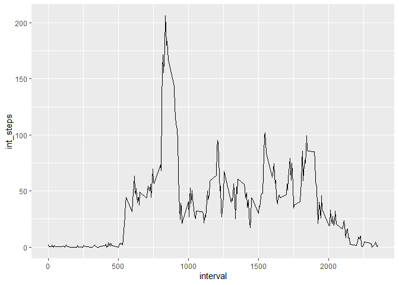

===============================================================================

### Loading and preprocessing the data

1. Load necessary libraries
2. Set file location
3. Read in the data
4. Tranform dates using as.Date()


```r
library(ggplot2)
library(dplyr)
```

```
## 
## Attaching package: 'dplyr'
```

```
## The following objects are masked from 'package:stats':
## 
##     filter, lag
```

```
## The following objects are masked from 'package:base':
## 
##     intersect, setdiff, setequal, union
```

```r
file_data <- "activity.csv"

data <- read.csv(file_data, header = TRUE, stringsAsFactors = FALSE)
data$date <- as.Date(as.character(data$date), "%Y-%m-%d")
head(data)
```

```
##   steps       date interval
## 1    NA 2012-10-01        0
## 2    NA 2012-10-01        5
## 3    NA 2012-10-01       10
## 4    NA 2012-10-01       15
## 5    NA 2012-10-01       20
## 6    NA 2012-10-01       25
```
________________________________________________________________________________

### What is the mean total number of steps taken per day?

1. Calculate the number of steps taken per day


```r
daily_data <- data %>%
        group_by(date) %>%
        summarize(daily_steps = sum(steps))
```

```
## `summarise()` ungrouping output (override with `.groups` argument)
```

```r
head(daily_data)
```

```
## # A tibble: 6 x 2
##   date       daily_steps
##   <date>           <int>
## 1 2012-10-01          NA
## 2 2012-10-02         126
## 3 2012-10-03       11352
## 4 2012-10-04       12116
## 5 2012-10-05       13294
## 6 2012-10-06       15420
```

2. Make a histogram of the total number of steps taken each day


```r
ggplot(daily_data, aes(daily_steps)) +
        geom_histogram(na.rm = TRUE, binwidth = 1000) +
        labs(title = "Number of Steps Taken per Day") +
        xlab("Daily Steps") +
        ylab("Number of Days") +
        theme(plot.title = element_text(hjust = 0.5))
```

<!-- -->

3. Calculate and report the mean and median of the total number of steps taken
        per day
        

```r
daily_data %>%
        summarize(daily_mean = mean(daily_steps, na.rm = TRUE),
                  daily_median = median(daily_steps, na.rm = TRUE))
```

```
## # A tibble: 1 x 2
##   daily_mean daily_median
##        <dbl>        <int>
## 1     10766.        10765
```

_______________________________________________________________________________

### What is the average daily activity pattern?

1. Make a time series plot (i.e. *type = "l"*) of the 5-minute interval (x-axis)
and the average number of steps taken, averaged across all days (y-axis)

a. Calculate the number of steps taken per interval 


```r
int_data <- data %>%
        na.omit() %>%
        group_by(interval) %>%
        summarize(int_steps = mean(steps))
```

```
## `summarise()` ungrouping output (override with `.groups` argument)
```

```r
head(int_data)
```

```
## # A tibble: 6 x 2
##   interval int_steps
##      <int>     <dbl>
## 1        0    1.72  
## 2        5    0.340 
## 3       10    0.132 
## 4       15    0.151 
## 5       20    0.0755
## 6       25    2.09
```

b. Create the time series plot


```r
ggplot(int_data, aes(interval, int_steps)) +
        geom_line()
```

<!-- -->

2. Which 5-minute interval, on average across all the days in the dataset,
contains the maximum number of steps?


```r
int_data %>%
        filter(int_steps == max(int_steps))
```

```
## # A tibble: 1 x 2
##   interval int_steps
##      <int>     <dbl>
## 1      835      206.
```

_______________________________________________________________________________      

### Imputing missing values

1. Calculate and report the total number of missing values in the dataset.


```r
sapply(data, function(x) sum(is.na(x)))
```

```
##    steps     date interval 
##     2304        0        0
```

2. Devise a strategy or filling in all of the missing values in the dataset.  

        We will replace each missing value with the average value for that time 
        interval in the dataset.

3. Create a new dataset that is equal to the original dataset but with the
missing data filled in.


```r
data_noNA <- data

for (i in 1:nrow(data)){
        if(is.na(data$steps[i])) {
                data_noNA$steps[i] <- 
                        int_data$int_steps[data_noNA$interval[i] 
                                           == int_data$interval]
        }
}

sapply(data_noNA, function(x) sum(is.na(x)))
```

```
##    steps     date interval 
##        0        0        0
```

4. Make a histogram of the total number of steps taken each day. (First, must
        calculate the steps taken each day, then graph)


```r
daily_data2 <- data_noNA %>%
        group_by(date) %>%
        summarize(daily_steps = sum(steps))
```

```
## `summarise()` ungrouping output (override with `.groups` argument)
```

```r
head(daily_data2)
```

```
## # A tibble: 6 x 2
##   date       daily_steps
##   <date>           <dbl>
## 1 2012-10-01      10766.
## 2 2012-10-02        126 
## 3 2012-10-03      11352 
## 4 2012-10-04      12116 
## 5 2012-10-05      13294 
## 6 2012-10-06      15420
```

```r
ggplot(daily_data2, aes(daily_steps)) +
        geom_histogram(na.rm = TRUE, binwidth = 1000) +
        labs(title = "Number of Steps Taken per Day") +
        xlab("Daily Steps") +
        ylab("Number of Days") +
        theme(plot.title = element_text(hjust = 0.5))
```

<!-- -->

4. (cont) Calculate the mean and median total number of steps taken per day.


```r
daily_data2 %>%
        summarize(daily_mean = mean(daily_steps, na.rm = TRUE),
                  daily_median = median(daily_steps, na.rm = TRUE))
```

```
## # A tibble: 1 x 2
##   daily_mean daily_median
##        <dbl>        <dbl>
## 1     10766.       10766.
```

4. (cont)  Do these values differ from the estimates from the first part of
the assignment?  What is the impact of imputing missing data on the estimates
of the total daily number of steps?

        These values do not differ. (mean is identical, median is different by 1).
        Imputing missing data on this dataset does not have an impact on any
        analysis.
        
### Are there differences in activity patterns between weekdays and weekends?

1. Create a new factor variable in the dataseet with two levels - "weekday" and 
"weekend" indicating whether a given date is a weekday or weekend day.


```r
data_noNA$day_week <- ifelse(weekdays(data_noNA$date) %in% 
                            c("Saturday", "Sunday"), "weekend", "weekday")
data_noNA$day_week <- as.factor(data_noNA$day_week)

head(data_noNA)
```

```
##       steps       date interval day_week
## 1 1.7169811 2012-10-01        0  weekday
## 2 0.3396226 2012-10-01        5  weekday
## 3 0.1320755 2012-10-01       10  weekday
## 4 0.1509434 2012-10-01       15  weekday
## 5 0.0754717 2012-10-01       20  weekday
## 6 2.0943396 2012-10-01       25  weekday
```

2. Make a panel plot containing a time series plot of the 5-minute intervals and 
the average number of steps taken, averaged across all weekday days or weekend
days. (First, must calculate the average steps per interval)


```r
int_data2 <- data_noNA %>%
        group_by(day_week, interval) %>%
        summarize(int_steps = mean(steps))
```

```
## `summarise()` regrouping output by 'day_week' (override with `.groups` argument)
```

```r
head(int_data2)
```

```
## # A tibble: 6 x 3
## # Groups:   day_week [1]
##   day_week interval int_steps
##   <fct>       <int>     <dbl>
## 1 weekday         0    2.25  
## 2 weekday         5    0.445 
## 3 weekday        10    0.173 
## 4 weekday        15    0.198 
## 5 weekday        20    0.0990
## 6 weekday        25    1.59
```

```r
ggplot(int_data2, aes(interval, int_steps)) +
        geom_line() +
        facet_grid(. ~ day_week)
```

<!-- -->
